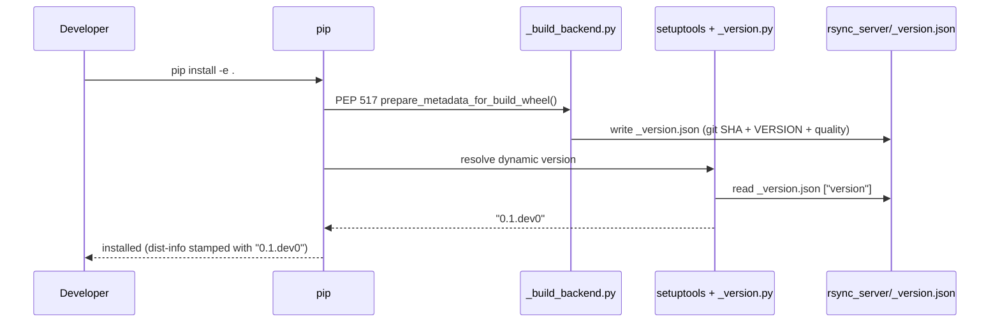
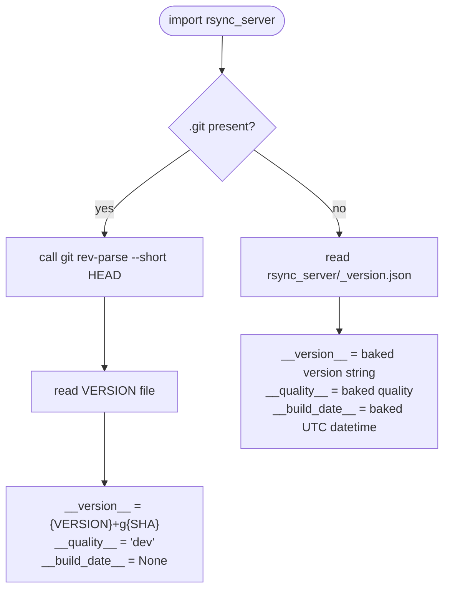
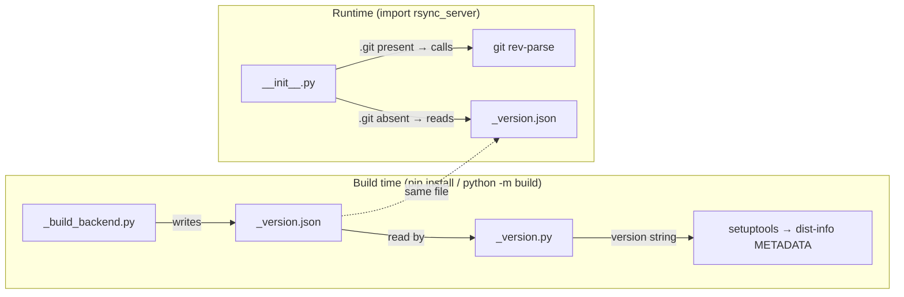

# Versioning

## Vision

The goal is a versioning system that:

- **requires no git tags** — version identity comes from a committed `VERSION`
  file plus a short commit SHA, not from tag annotations
- **never runs git at import time in production** — metadata is baked into the
  built artifact; git is only called in development (`.git` present)
- **puts all build-time logic in one place** — a custom PEP 517 backend
  (`_build_backend.py`) is the single owner of `_version.json`; nothing else
  writes it
- **keeps the runtime simple** — `__init__.py` makes one decision (`.git`
  present or not) and reads from one source

The design is modelled after VS Code's `product.json`: a plain JSON file
baked into the artifact at build time carrying exact metadata, with a clear
fallback for source checkouts.

---

## How `pip install -e .` works

Running `pip install -e .` triggers three distinct phases. It is important to
understand that **setuptools/`_version.py`** and **`__init__.py`** are
involved at completely different times and never interact with each other.



After install `_version.py` is **never imported again**. It is a one-shot
shim whose only job is satisfying setuptools' version resolver at build time.

---

## How `import rsync_server` works at runtime

At runtime, `__init__.py` makes a single decision based on whether `.git`
exists, then reads from exactly one source.



`.git` present means a development checkout (editable install or raw source).
`.git` absent means a shipped artifact (installed wheel or extracted sdist).

---

## Two separate concerns, two separate files



`_version.py` and `__init__.py` never interact. They share `_version.json`
as a data file but at completely different moments.

---

## Design decisions

### `.git` presence, not `_version.json` presence, as the branch condition

The original design branched on whether `_version.json` existed. This caused
a staleness problem with editable installs: `pip install -e .` writes the JSON
once, and it then goes out of date on every subsequent commit. The condition
was changed to `.git` directory presence. Any git checkout (editable or not)
always computes live metadata; only a true installed artifact (no `.git`) reads
the baked-in JSON. The two cases map cleanly to "in development" vs "shipped".

### JSON, not Python, for metadata

Metadata is stored in `_version.json` rather than a generated `_version.py`.
JSON has no import side-effects, is easy to inspect with any tool, and cannot
accidentally execute code. `_version.py` exists solely as a setuptools shim
(see below) and does not carry runtime metadata.

### No git calls at import time in production

Early designs cached a live git call into `_version.json` on first import.
This was removed: it blurred the boundary between build time and runtime,
caused surprising stale-cache behaviour, and made imports slower. Git is only
called by the build backend or by `__init__.py` when `.git` is present (i.e.
development only — never in a shipped artifact).

### VERSION file as source of truth

The base version (`MAJOR.MINOR`, e.g. `0.1`) lives in a committed `VERSION`
file. This is the only file a developer edits when bumping the version. There
are no version strings duplicated across `pyproject.toml`, `__init__.py`, or
anywhere else.

### No tags required

Versions are not derived from `git describe` or tag annotations. This means
a release can be cut from any commit on any branch without first pushing a
tag. The `RELEASE_TYPE` environment variable controls the quality suffix
instead.

### Commit SHA, not commit count

The live-git path uses `{VERSION}+g{short SHA}` (e.g. `0.1+g701e4ca`).
An earlier version included the commit count (`0.1.3+g701e4ca`). This was
dropped: the count adds false precision, implies a linear history, and the
SHA alone is sufficient to uniquely identify a commit.

### No `dirty` flag

An earlier iteration tracked whether the working tree had uncommitted changes.
This was removed — it is only meaningful at the exact moment of the build, is
not reproducible, and adds noise to the metadata without actionable value.

### No `branch` field

Branch names were considered but removed. A branch name is mutable (branches
move, get deleted, get renamed), whereas a commit SHA is immutable. Anyone
who needs to know which branch produced a build can look it up from the SHA.

### `__build_date__` is `None` in development

When `.git` is present, `__build_date__` is `None`. There is no meaningful
"build date" for a live checkout, and `None` communicates that clearly without
pretending otherwise.

### `_version.py` is a setuptools shim only

`pyproject.toml` uses `dynamic = ["version"]` with
`{attr = "rsync_server._version.__version__"}`. Setuptools imports
`_version.py` at build time to resolve the version string. This file does
nothing else — it is not imported by `__init__.py` or any runtime code.

---

## Version string format

The version string is determined by the `RELEASE_TYPE` environment variable
(default: `dev`):

| `RELEASE_TYPE` | Example | Intended use |
|---|---|---|
| `stable` | `0.1` | PyPI release |
| `rc` | `0.1rc1` | PyPI pre-release / candidate |
| `dev` | `0.1.dev0` | Unofficial / CI build |

In development (`.git` present), the version is always
`{VERSION}+g{short SHA}`, e.g. `0.1+g701e4ca`.

---

## Files

| File | Purpose |
|---|---|
| `VERSION` | Committed base version (`MAJOR.MINOR`) — the only version you edit by hand |
| `rsync_server/_version.json` | Generated at build time; gitignored |
| `rsync_server/_version.py` | Setuptools shim — read once at build time to satisfy `pyproject.toml` dynamic version; never imported at runtime |
| `rsync_server/__init__.py` | Public runtime API — branches on `.git` presence |
| `_build_backend.py` | Custom PEP 517 wrapper — writes `_version.json` before the wheel/sdist is assembled |
| `scripts/release.py` | Manual release script — sets `RELEASE_TYPE` and triggers the build |

---

## Cutting a release

```sh
# Bump VERSION manually, then:
python scripts/release.py          # prompts before publishing
```

`scripts/release.py` sets `RELEASE_TYPE=stable` (or `rc`) and runs
`python -m build`, which triggers `_build_backend.py` → writes `_version.json`
with the correct version and commit SHA → packages the wheel/sdist.
