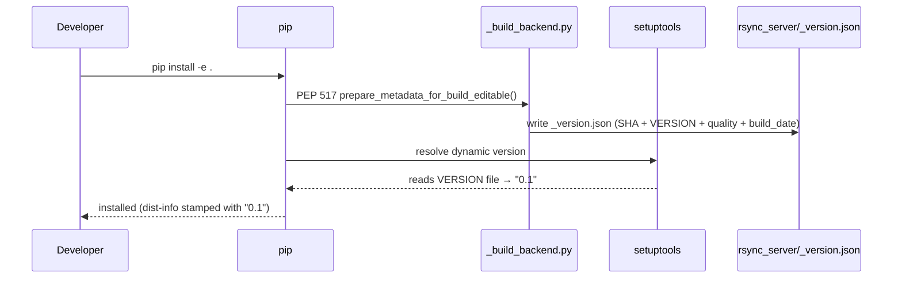
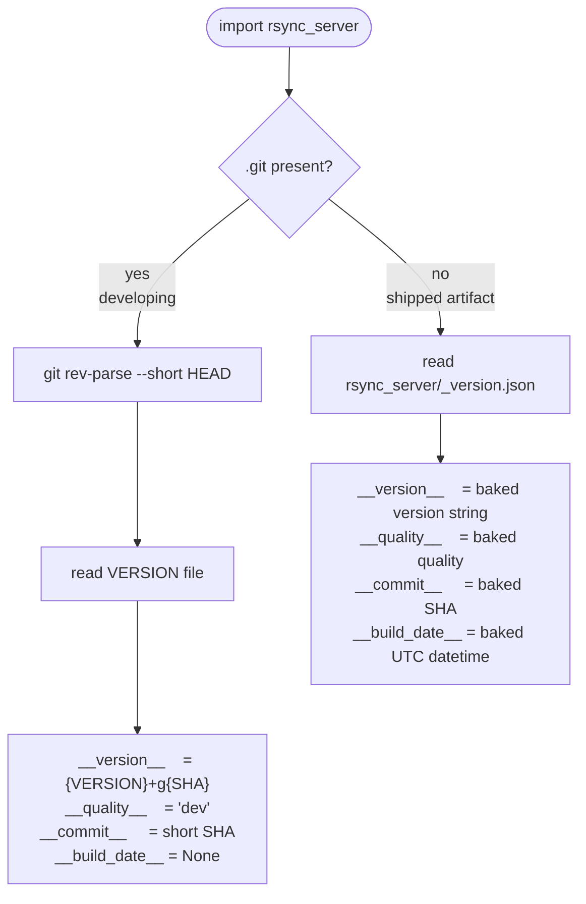
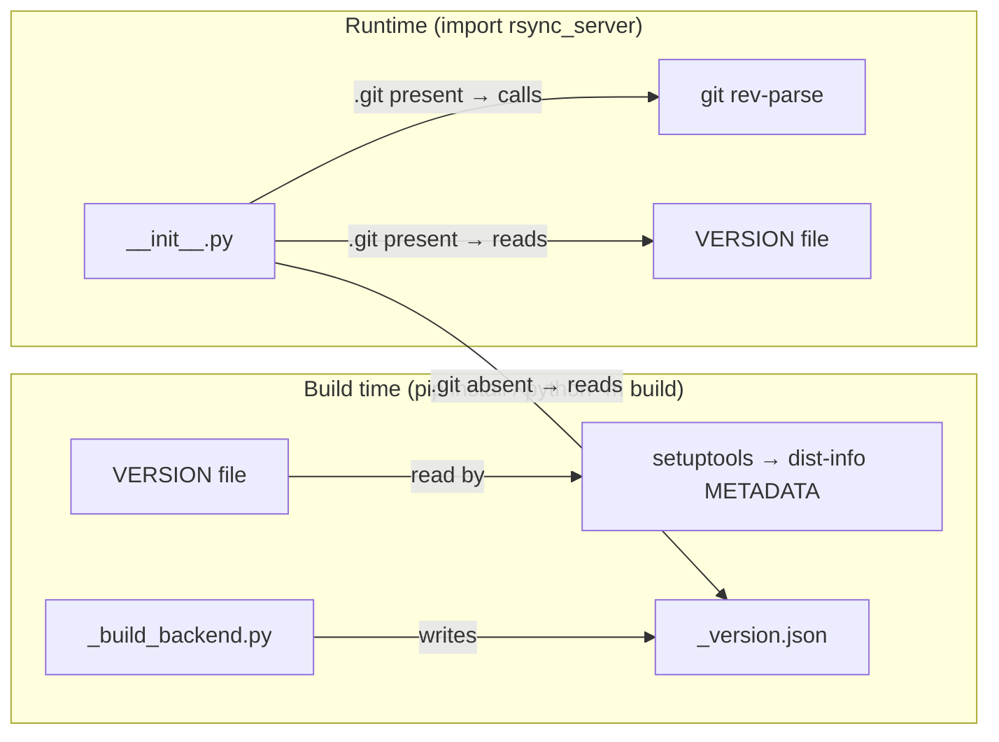

# Versioning

## Vision

The goal is a versioning system that:

- **requires no git tags** — version identity comes from a committed `VERSION`
  file plus a short commit SHA, not from tag annotations
- **never runs git at import time in production** — metadata is baked into the
  built artifact; git is only called in development (`.git` present)
- **puts all build-time logic in one place** — a custom PEP 517 backend
  (`_build_backend.py`) is the single owner of `_version.json`; nothing else
  writes it
- **keeps the runtime simple** — `__init__.py` makes one decision (`.git`
  present or not) and reads from one source
- **clean separation between versioning and releasing** — the `VERSION` file
  and git SHA are about identity; `RELEASE_TYPE` and `__quality__` are about
  shipping; they live in different places and never bleed into each other

The design is modelled after VS Code's `product.json`: a plain JSON file
baked into the artifact at build time carrying exact metadata, with a clear
fallback for source checkouts.

---

## Versioning vs releasing

These are two distinct concerns that happen at different times:

**Versioning** — "what commit is this?"

- Always in play, whether developing or shipping
- Driven by the `VERSION` file (base) and git SHA (identity)
- Handled by `__init__.py` at import time
- Result: `0.1+g701e4ca`

**Releasing** — "what quality level was this build intended for?"

- Only relevant at build time, when cutting a wheel to hand to someone
- Driven by the `RELEASE_TYPE` env var (`dev` / `rc` / `stable`)
- Handled by `_build_backend.py`, baked into `_version.json` once
- Result: `__quality__ = "stable"`, version string `0.1`

In `__init__.py`, `__quality__` is just exposing the baked release decision
as a read-only fact. In the `.git` branch it is hardcoded to `"dev"` because
there is no build, so there is no quality decision to reflect.

---

## How `pip install -e .` works

Running `pip install -e .` triggers the PEP 517 build backend once. The wheel
version is read directly from the `VERSION` file by setuptools — no shim
needed. `_build_backend.py` writes `_version.json` with the full runtime
metadata before setuptools assembles the package.



After install, `_version.json` exists on disk but is never consulted again
during development — `.git` is present, so `__init__.py` always uses live git.

---

## How `import rsync_server` works at runtime

`__init__.py` makes a single decision based on `.git` presence, then reads
from exactly one source. The two paths map cleanly to "developing" vs "shipped".



---

## Two separate concerns, two separate files



`setuptools` and `__init__.py` never interact. They both read `VERSION` and
`_version.json` as plain data files, but at completely different moments for
completely different purposes.

---

## Design decisions

### Versioning and releasing are separated by design

`__init__.py` knows nothing about `RELEASE_TYPE`. It exposes `__quality__` as
a fact read from `_version.json` (artifact path) or hardcoded as `"dev"`
(development path). The decision of what quality level a build is belongs
entirely to `_build_backend.py` at build time. This keeps the runtime free of
build-time concerns.

### `.git` presence, not `_version.json` presence, as the branch condition

The original design branched on whether `_version.json` existed. This caused
a staleness problem: `pip install -e .` writes the JSON once at install time,
and it then goes out of date on every subsequent commit. Switching to `.git`
presence fixes this — any git checkout always computes live metadata, so the
version always reflects the actual current commit.

### `VERSION` file read directly by setuptools — no shim needed

An earlier design used a `_version.py` shim to expose `__version__` for
setuptools' `{attr = ...}` resolver. This was removed in favour of
`version = {file = "VERSION"}` in `pyproject.toml`. Setuptools reads `VERSION`
directly; one fewer file, one fewer concept.

### JSON, not Python, for runtime metadata

Runtime metadata is stored in `_version.json`. JSON has no import
side-effects, is easy to inspect with any tool, and cannot accidentally execute
code. It is the only artifact `_build_backend.py` produces.

### No git calls at import time in production

Git is only called by `_build_backend.py` (build time) or by `__init__.py`
when `.git` is present (development only). A shipped wheel never calls git.

### `VERSION` file as the single version source of truth

The base version (`MAJOR.MINOR`, e.g. `0.1`) lives in a committed `VERSION`
file. It is read by setuptools for wheel metadata and by `__init__.py` for
the live version string. No version strings anywhere else.

### No tags required

Versions are not derived from `git describe` or tag annotations. A release can
be cut from any commit without pushing a tag first. `RELEASE_TYPE` controls
the quality suffix instead.

### Commit SHA, not commit count

The live-git path produces `{VERSION}+g{short SHA}` (e.g. `0.1+g701e4ca`).
An earlier version included a commit count (`0.1.3+g701e4ca`) — dropped
because it implies a linear history and the SHA alone uniquely identifies the
commit.

### No `dirty` flag

Removed — only meaningful at the exact moment of the build, not reproducible,
and adds noise without actionable value.

### No `branch` field

Branch names are mutable (they move, get deleted, get renamed). A commit SHA
is immutable. The branch can always be looked up from the SHA if needed.

### `__build_date__` is `None` in development

There is no meaningful build date for a live checkout. `None` communicates
this clearly rather than using a sentinel like `datetime.min`.

---

## Version string format

| Scenario | Example | How |
|---|---|---|
| Development (`.git` present) | `0.1+g701e4ca` | `VERSION` + git SHA |
| Artifact — `stable` | `0.1` | `VERSION` as-is |
| Artifact — `rc` | `0.1rc1` | `VERSION` + `rc1` suffix |
| Artifact — `dev` | `0.1.dev0` | `VERSION` + `.dev0` suffix |

`RELEASE_TYPE` (default: `dev`) controls which artifact format is used.

---

## Files

| File | Purpose |
|---|---|
| `VERSION` | Committed base version (`MAJOR.MINOR`) — the only file you edit when bumping |
| `rsync_server/_version.json` | Generated at build time; gitignored; carries runtime metadata for shipped artifacts |
| `rsync_server/__init__.py` | Public runtime API — branches on `.git` presence |
| `_build_backend.py` | Custom PEP 517 wrapper — writes `_version.json` before the wheel/sdist is assembled |
| `scripts/release.py` | Manual release script — sets `RELEASE_TYPE` and triggers the build |

---

## Cutting a release

```sh
# Bump VERSION manually, then:
python scripts/release.py          # prompts before publishing
```

`scripts/release.py` sets `RELEASE_TYPE=stable` (or `rc`) and runs
`python -m build`, which triggers `_build_backend.py` → writes `_version.json`
with the correct version and commit SHA → packages the wheel/sdist.
